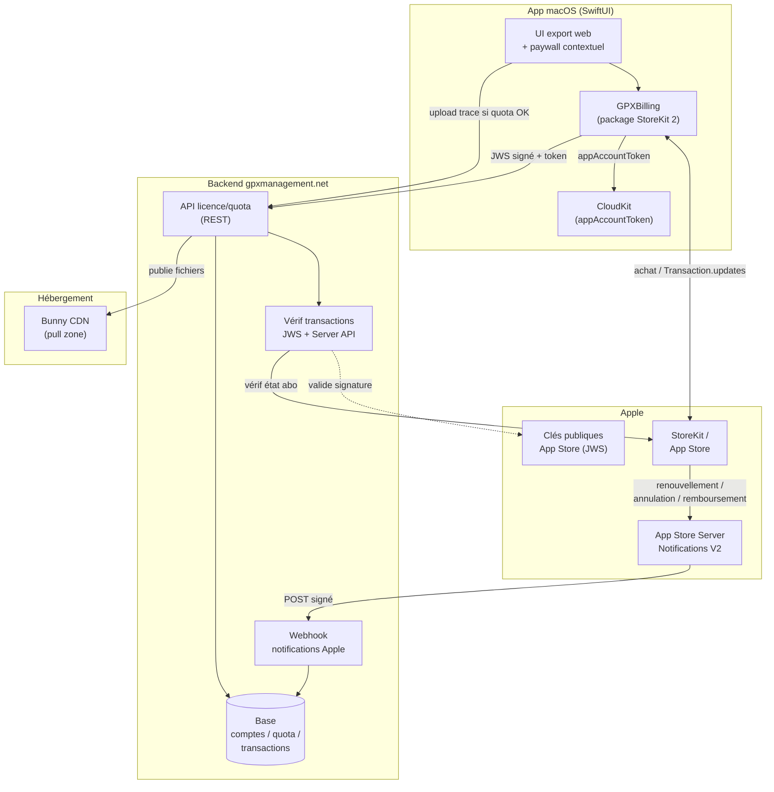
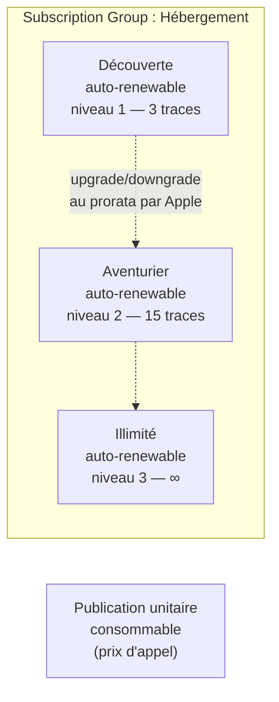
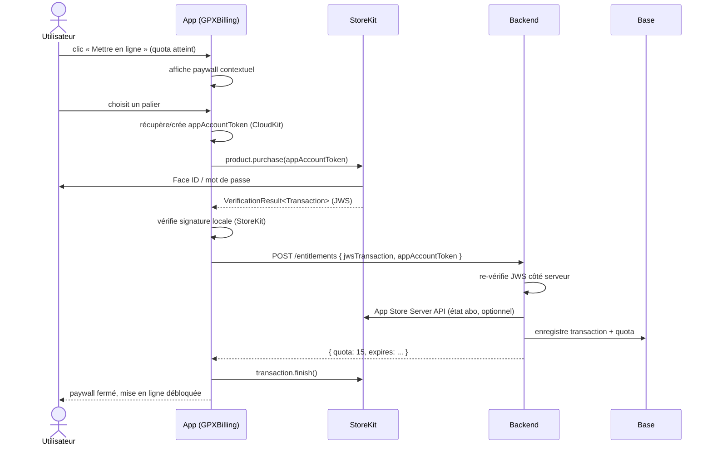
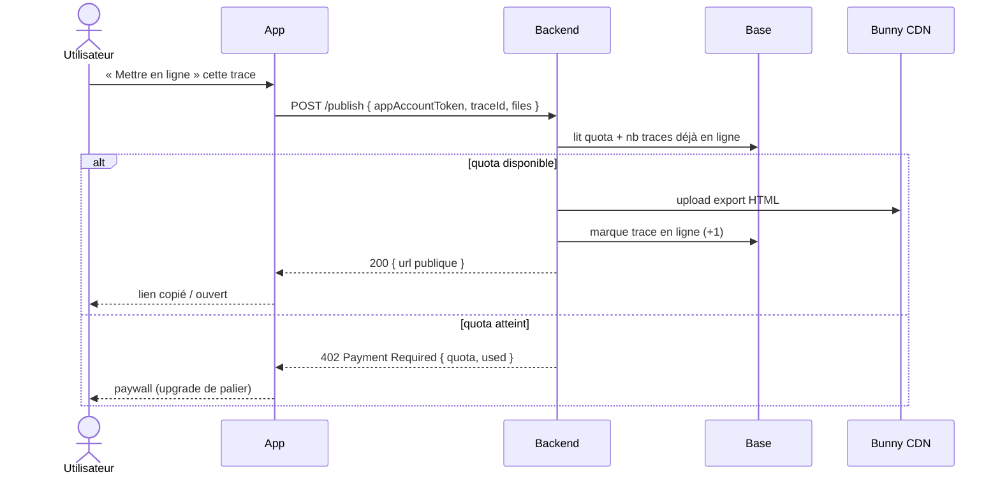
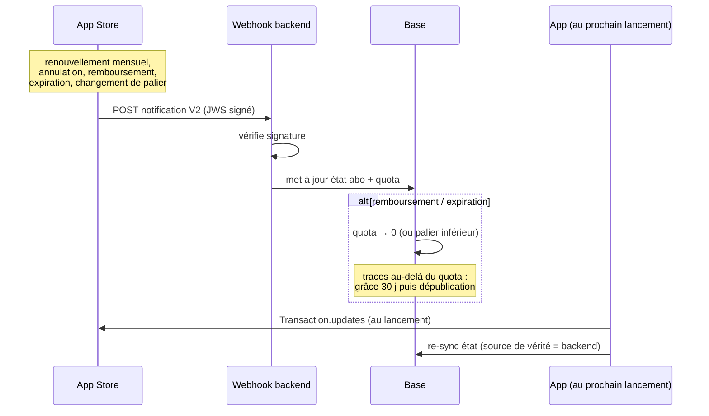
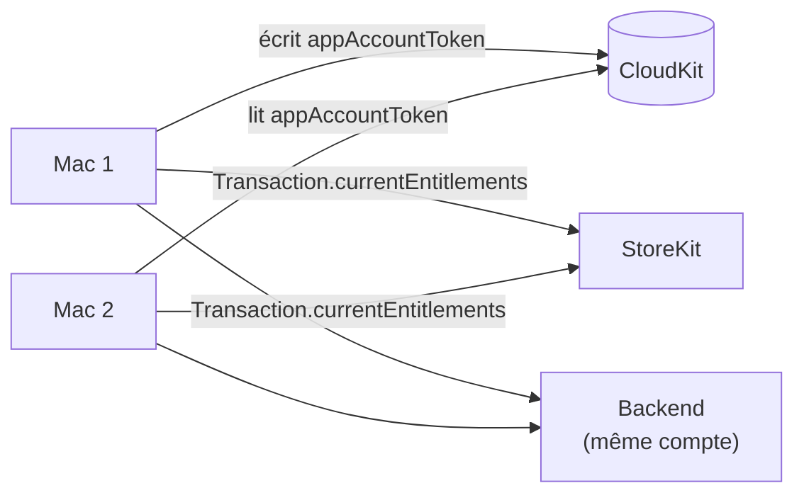
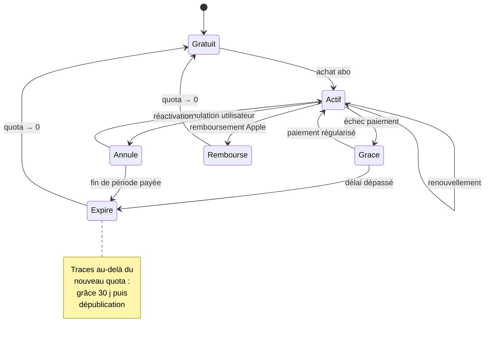
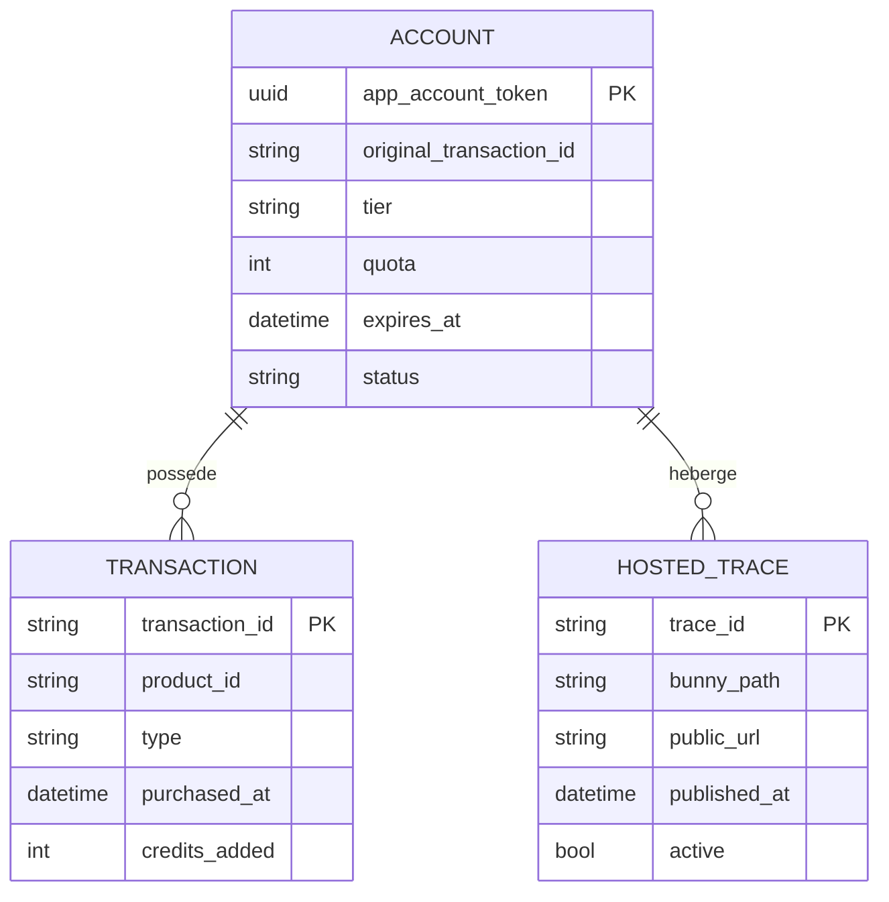
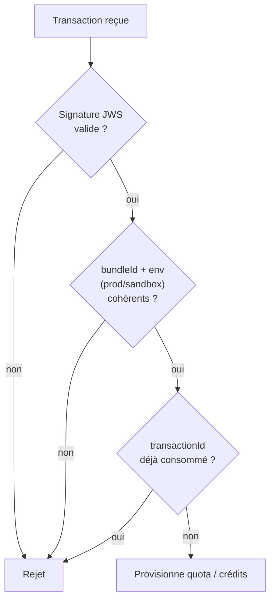

# Architecture technique — Facturation de l'hébergement via Apple IAP

> Étude technique : facturer la **mise en ligne de traces** sur `gpxmanagement.net`
> via l'In-App Purchase Apple (StoreKit 2). Le reste de l'app reste gratuit.
>
> Prérequis assumé : **l'app est distribuée sur le Mac App Store** (StoreKit n'existe
> pas en distribution Developer ID/DMG). Modèle retenu : **abonnement par paliers de
> traces en ligne** + **publication unitaire consommable** comme prix d'appel.

---

## 1. Vue d'ensemble des composants



### Rôles

| Composant | Responsabilité |
|---|---|
| **GPXBilling** (nouveau package) | Charge les produits, déclenche l'achat, écoute `Transaction.updates`, expose l'état d'habilitation à l'UI. Isolé comme `GPXCore`/`GPXStrava` pour un futur portage iOS. |
| **CloudKit** | Stocke l'`appAccountToken` (UUID) pour que l'identité d'achat soit **stable entre les Mac** de Romain (setup multi-machine). |
| **StoreKit / App Store** | Vend les produits, signe chaque transaction en **JWS**, gère le renouvellement des abonnements. |
| **Backend** | Source de vérité du **quota** : vérifie les transactions, mappe abonnement → nombre de traces autorisées, autorise/refuse la mise en ligne, héberge sur Bunny. |
| **App Store Server Notifications V2** | Pousse les événements asynchrones (renouvellement, annulation, remboursement, expiration) vers le backend. Indispensable : l'app peut être fermée au moment du renouvellement. |
| **Bunny CDN** | Stockage/diffusion des exports HTML (déjà en place). |

---

## 2. Produits App Store Connect



- Les 3 paliers vivent dans **un seul subscription group** → Apple gère seul l'upgrade/downgrade proratisé et empêche le cumul.
- Le **consommable** est hors groupe (achat indépendant, re-achetable).
- Apple ne connaît **pas** la sémantique « 3 / 15 / ∞ traces » : c'est le backend qui mappe `productID → quota`.

---

## 3. Flux d'achat (abonnement ou crédit)



Points clés :
- L'`appAccountToken` (UUID) est **passé à l'achat** → c'est le lien entre la transaction Apple et le compte gpxmanagement.net.
- **Double vérification** : signature validée sur l'app (UX rapide) **et** re-validée côté serveur (sécurité — l'app n'est pas une source de confiance).
- `transaction.finish()` seulement **après** confirmation backend, pour ne pas perdre un achat en cas d'erreur réseau.

---

## 4. Flux de mise en ligne d'une trace (gating quota)



- Le **backend est l'arbitre** du quota — jamais l'app (contournable).
- Retirer une trace en ligne décrémente le compteur → un slot se libère (cohérent avec le modèle « stock »).

---

## 5. Événements asynchrones (renouvellement / annulation / remboursement)



- **App Store Server Notifications V2** est la seule façon fiable de savoir qu'un abonnement s'est renouvelé/annulé **app fermée**.
- Politique de dépassement à définir : période de grâce avant dépublication des traces excédentaires (recommandé pour ne pas casser des liens partagés brutalement).

---

## 6. Restauration & multi-machine



- L'`appAccountToken` synchronisé via **CloudKit** garantit que les deux Mac pointent vers **le même compte** côté backend.
- `Transaction.currentEntitlements` permet de **restaurer** l'abonnement sans nouvel achat (même Apple ID).
- Aucun bouton « Restaurer » obligatoire avec StoreKit 2 : les entitlements sont déjà disponibles, mais en prévoir un pour rassurer.

---

## 7. Machine à états du quota (côté backend)



---

## 8. Modèle de données backend (minimal)



- `app_account_token` = clé d'identité (généré par l'app, lié à l'Apple ID via la transaction).
- `quota` recalculé à chaque notification Apple (abo) + crédits consommables.
- `HOSTED_TRACE.active` permet la dépublication sans perdre l'historique.

---

## 9. Sécurité — points non négociables



- **Toujours re-vérifier la signature côté serveur** avec les clés publiques App Store — l'app n'est pas une source de confiance.
- **Anti-rejeu** : un `transactionId` ne doit créditer qu'une fois.
- **Vérifier l'environnement** (sandbox vs production) pour éviter qu'un achat de test ne crédite en prod.
- Le `client_secret` Strava et toute clé serveur restent **hors repo** (`Secrets.xcconfig` + secrets backend), conformément à la règle projet.

---

## 10. Décisions ouvertes

1. **Backend** : techno et hébergement (un petit service suffit — vérif JWS + quota + webhook). Aujourd'hui l'export pousse des fichiers statiques sur Bunny sans serveur ; l'IAP **impose** un composant serveur.
2. **Coût réel par trace hébergée** (stockage + bande passante Bunny) → fixe les seuils des paliers.
3. **Politique de dépassement** après expiration/downgrade : durée de grâce, ordre de dépublication.
4. **Crédits consommables** : durée d'hébergement par crédit (permanent = coût non couvert, à borner).
5. **Chemin minimal possible** : démarrer sans backend en vérifiant les entitlements **on-device** (StoreKit 2 valide la signature localement) et en stockant le quota dans CloudKit — plus simple, mais quota contournable et pas de webhook fiable. À réserver à un MVP.
```
