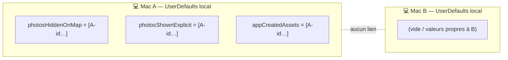
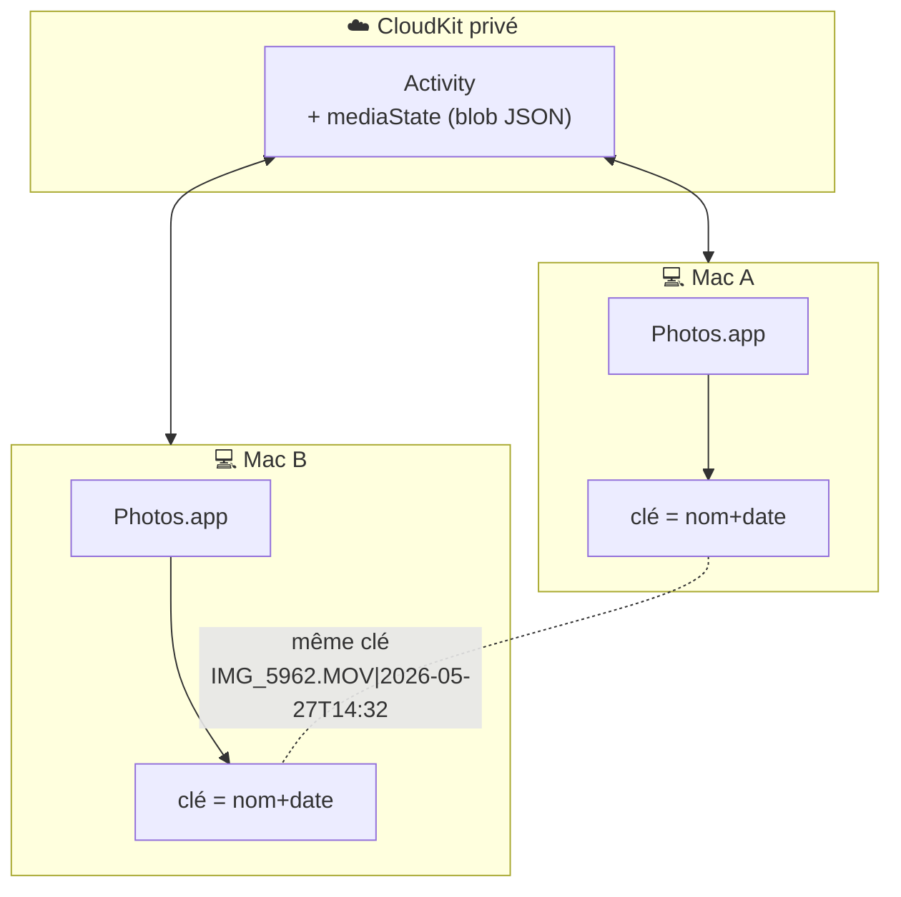
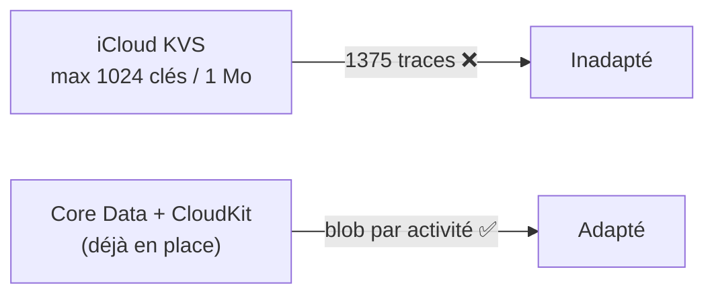
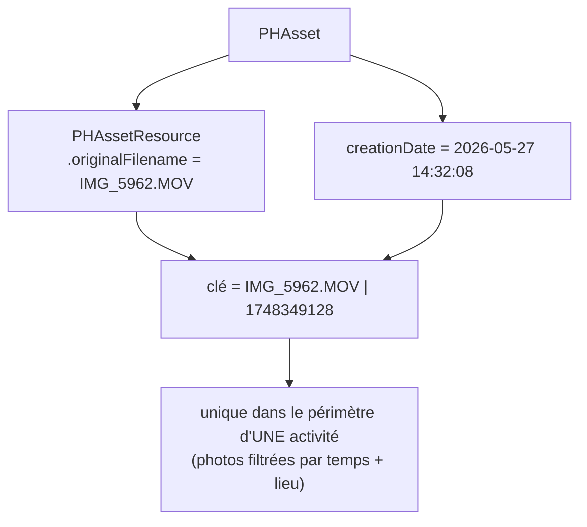
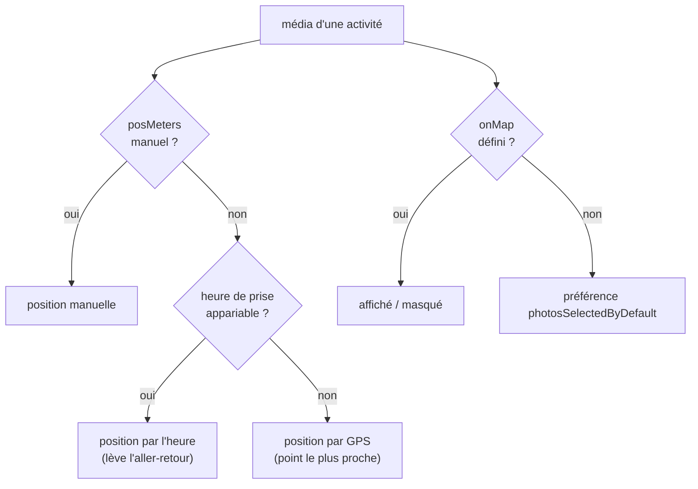
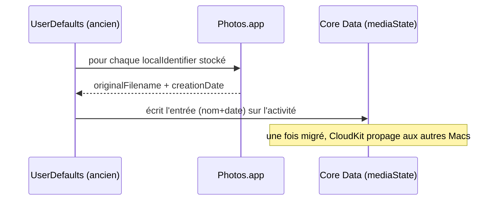

# Plan d'action — état des médias synchronisé entre Macs

> Objectif : **toutes** les informations qu'on attache à une photo/vidéo (affichage sur la carte, position manuelle sur la trace, marquage « créé par l'app ») doivent être **identiques sur toutes les machines**.

---

## 1. Principe

Deux briques à corriger ensemble :

1. **Identité stable d'un média entre Macs** — ne plus utiliser `PHAsset.localIdentifier` (différent sur chaque Mac), mais **`originalFilename` + `creationDate`** (voyagent avec la photo via Photothèque iCloud).
2. **Stockage synchronisé et à la bonne échelle** — sortir de `UserDefaults` (local) **et** de l'iCloud KVS (trop petit), pour mettre cet état dans **Core Data + CloudKit**, attaché à l'activité.

---

## 2. État actuel (tout est local à un Mac)

| Information | Où c'est stocké | Clé | Synchronisé ? |
|---|---|---|---|
| Photo affichée/masquée sur la carte | `UserDefaults` (`photosHiddenOnMap`, `photosShownExplicit`) | `localIdentifier` | ❌ |
| Média créé par l'app (recadrage…) | `UserDefaults` (`appCreatedAssets`, JSON) | `localIdentifier` | ❌ |
| Position du média sur la trace | *(n'existe pas encore — recalculé à la volée)* | — | — |



---

## 3. Cible

| Information | Où | Clé | Synchronisé ? |
|---|---|---|---|
| Affichée/masquée sur la carte | Core Data (blob `mediaState` sur `Activity`) → CloudKit | `originalFilename` + `creationDate` | ✅ |
| Créé par l'app | idem | idem | ✅ |
| Position manuelle sur la trace | idem | idem | ✅ |



---

## 4. Pourquoi Core Data/CloudKit et pas l'iCloud KVS

L'iCloud Key-Value Store (où vivent déjà les préférences via `CloudPreferences`) est **plafonné à 1024 clés et 1 Mo au total**. Avec **~1375 traces** ayant chacune plusieurs médias, on dépasse forcément. CloudKit (déjà utilisé pour les activités) n'a pas cette limite et synchronise au même endroit que le reste des données.



---

## 5. Identité stable d'un média



- Nom + date arrondie à la seconde → unique au sein d'une sortie, même avec deux appareils.
- Seul angle mort accepté : deux appareils différents, **même nom ET même seconde** (raid multi-caméras synchronisées) — négligeable.

---

## 6. Modèle de données

Ajout d'un attribut **optionnel** `mediaState` (Binary/Transformable) sur l'entité `Activity` → migration légère, compatible CloudKit (nouvel attribut optionnel).

Contenu = JSON, une entrée par média ayant un état explicite :

```json
[
  {
    "file": "IMG_5962.MOV",
    "date": 1748349128,
    "onMap": true,          // true=affiché, false=masqué, absent=défaut (préférence globale)
    "posMeters": 12400.0,   // position manuelle le long de la trace ; absent=auto (heure→GPS)
    "appCreated": false
  }
]
```

On ne stocke que les **décisions explicites** (comme aujourd'hui) : une photo sans entrée suit les règles auto.

---

## 7. Résolution unifiée (lue partout : carte, profil, web, PDF, film)



Aujourd'hui cette logique est éparpillée (`isPhotoShown` dans la vue, `resolvedCoordinate` dans GPXRender, `distanceForMedia` dans GPXVideo). **On la centralise** dans un service unique de GPXCore/GPXRender pour qu'un réglage se voie de façon identique partout.

---

## 8. Migration des données locales existantes

Au premier lancement de la nouvelle version, sur chaque Mac : convertir les anciennes clés `UserDefaults` (par `localIdentifier`) vers le nouveau format (par `nom+date`) dans `mediaState`, puis ne plus écrire dans `UserDefaults`.



Best-effort : un asset introuvable (supprimé) est simplement ignoré.

---

## 9. Plan d'action par étapes

> Chaque étape = un incrément buildable/testable, commité séparément.

- [ ] **Étape 1 — Identité + stockage.**
  - `PhotoLibraryService.stableKey(for:)` = `originalFilename` + `creationDate`.
  - Attribut `mediaState` sur `Activity` (migration légère) + accès lecture/écriture dans le repo (`fetchMediaState`/`updateMediaState`), synchro CloudKit.
- [ ] **Étape 2 — Résolution centralisée.**
  - Service unique `MediaPlacement` (priorité manuel→heure→GPS ; sélection explicite→défaut).
  - Brancher carte de détail + export web/PDF + film dessus (remplace `isPhotoShown`, `resolvedCoordinate`, `distanceForMedia`).
- [ ] **Étape 3 — Sélection carte reconstruite.**
  - Le toggle « sur la carte » écrit dans `mediaState` (plus dans `UserDefaults`).
  - `appCreated` déplacé dans `mediaState`.
  - Migration des anciennes clés locales (§8).
- [ ] **Étape 4 — Éditeur de position (carte + profil).**
  - Feuille validée précédemment : marqueur aimanté + scrubber profil, fantômes GPS/heure, Auto heure / Auto GPS / Réinitialiser.
  - Écrit `posMeters` dans `mediaState`.
- [ ] **Étape 5 — Cohérence.**
  - Détection écart heure↔GPS > 150 m → badge ⚠︎ sur la vignette + message dans l'éditeur.

---

## 10. Points ouverts / risques

- **Photothèque iCloud requise** pour que les médias (et donc nom+date) soient les mêmes partout. Si elle est désactivée sur un Mac, l'état se synchronise mais ne trouve pas les photos correspondantes (dégradation propre, pas de crash).
- **Migration Core Data + CloudKit** : valider qu'un nouvel attribut optionnel passe en migration légère sans casser le store iCloud existant (à tester sur une copie).
- **Volume du blob** : négligeable (quelques entrées JSON par activité), bien en-deçà des limites CloudKit.
- **Raids multi-participants** : si deux caméras produisent le même nom à la même seconde, collision possible — acceptée.

