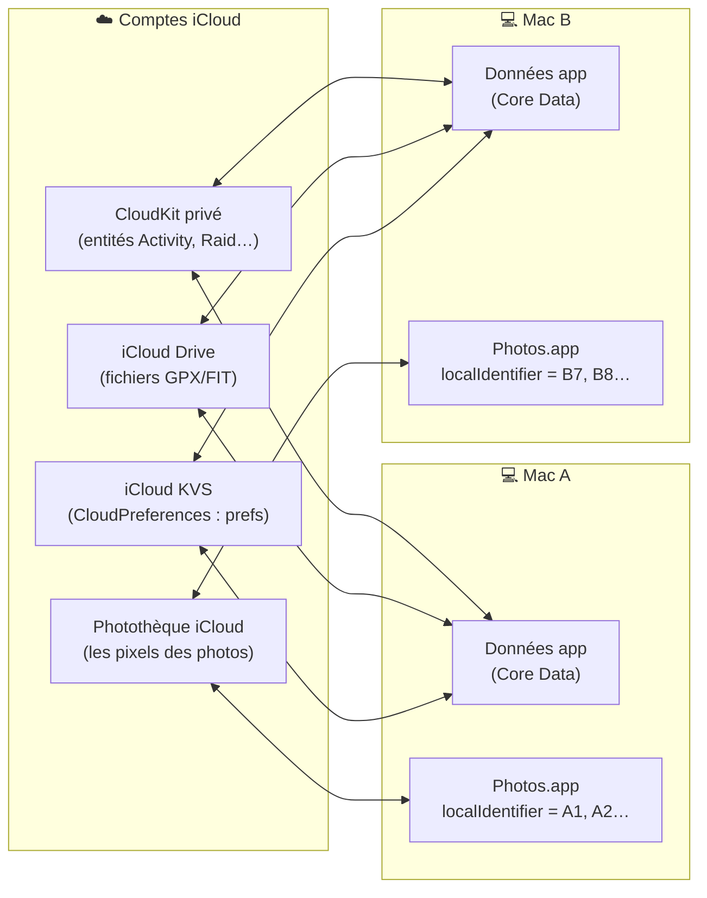
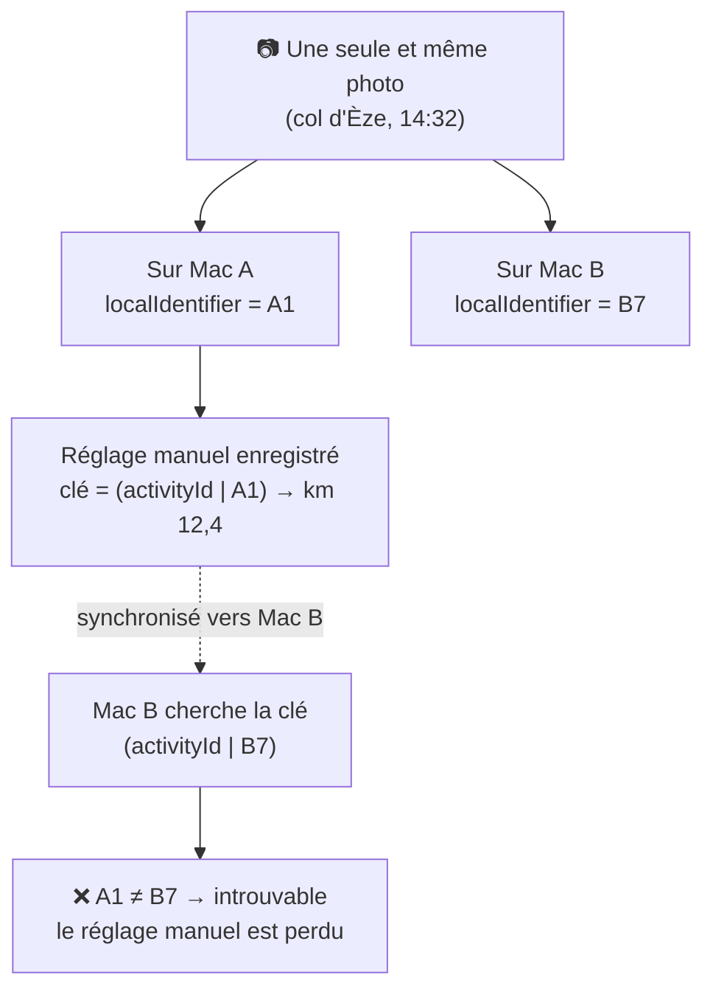
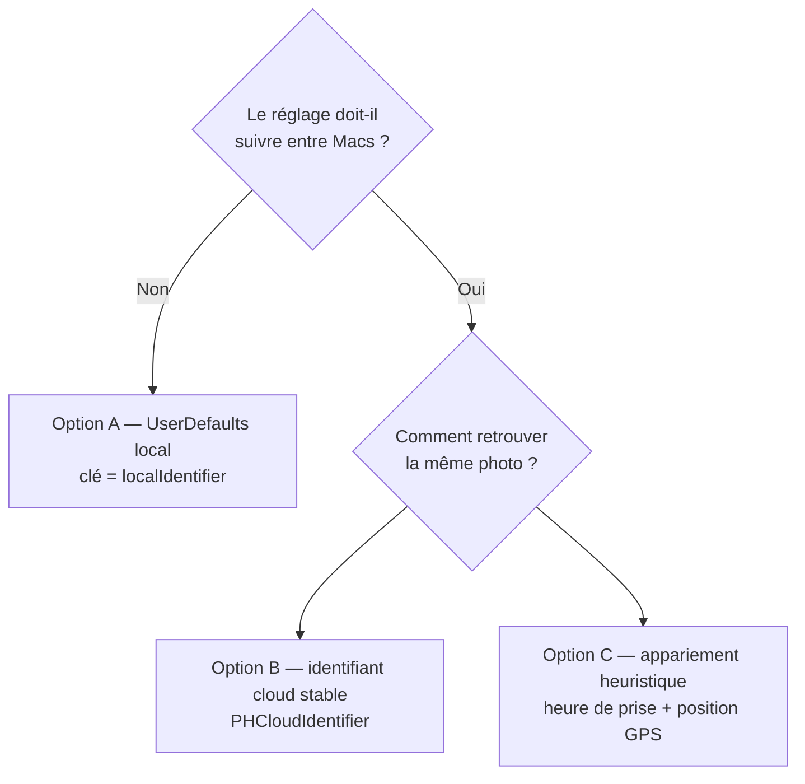

# Positions des médias sur la trace — le problème multi-Mac

> Note explicative jetable (pas une doc projet permanente). Supprime-la quand tu veux.

## De quoi on parle

On veut mémoriser, pour chaque photo/vidéo, **où elle est placée le long d'une trace** (en plus de l'auto par heure/GPS). La question : ce réglage doit-il **suivre d'un Mac à l'autre** ?

## Ce qui synchronise déjà aujourd'hui, et ce qui reste local

Point clé : **les photos elles-mêmes** se synchronisent (via Photothèque iCloud, si tu l'utilises) — donc la même image existe sur les deux Macs. **Mais l'app ne stocke pas les photos** ; elle les référence par un identifiant fourni par Photos.app : le `PHAsset.localIdentifier`.

## Le piège : `localIdentifier` n'est pas le même sur deux Macs

`localIdentifier` est un identifiant **propre à la photothèque locale** (ressemble à `B84E8479-…/L0/001`). La même photo, vue depuis l'autre Mac, porte un **identifiant différent**.

Donc même si on **synchronisait** le réglage, Mac B ne saurait pas à quelle photo le rattacher : il chercherait `B7` et trouverait une clé écrite pour `A1`. Résultat : la photo retombe sur l'auto (heure/GPS) sur le second Mac.

> À noter : le show/hide des photos sur la carte (`shownPhotosKey` / `hiddenPhotosKey`) fonctionne **déjà** comme ça — stocké en `UserDefaults` local, par `localIdentifier`, et ne traverse pas non plus. Et `appCreatedAssets` est volontairement gardé local. Le réglage de position s'inscrirait dans la même logique.

## Les 3 façons de faire

| Option | Stockage | Clé | Traverse les Macs ? | Coût / risque |
|---|---|---|---|---|
| **A** (ma reco) | `UserDefaults` local | `localIdentifier` | Non — à réajuster sur l'autre Mac si besoin | Le plus simple, cohérent avec l'existant |
| **B** | iCloud KVS (CloudPreferences) | `PHCloudIdentifier` (id stable Apple) | Oui | Faut résoudre cloud↔local à chaque session (API `cloudIdentifierMappings`), échoue si la Photothèque iCloud n'est pas activée |
| **C** | iCloud KVS | heure de prise + GPS arrondis | Oui, mais flou | Faux positifs possibles (2 photos même minute/lieu), logique d'appariement à maintenir |

## Pourquoi je recommande l'option A

1. **Impact réel faible si ça ne traverse pas** : le réglage manuel est un *micro-ajustement*. Sur le second Mac, sans l'override, la photo se place quand même correctement par l'heure (et c'est ce qu'on vient de fiabiliser pour les allers-retours). On ne perd pas la photo, juste le petit décalage corrigé à la main.
2. **Cohérence** : l'app traite déjà tout ce qui touche aux `PHAsset` en local (show/hide carte, appCreatedAssets). On ne crée pas un cas particulier.
3. **Simplicité** : pas de résolution d'identifiants cloud à chaque lancement, pas de dépendance à l'état de la Photothèque iCloud.

Si un jour tu veux vraiment que ça suive, **l'option B** est la bonne (identifiant stable Apple), et on pourra migrer sans changer l'UI de l'éditeur — seule la couche de stockage change.
